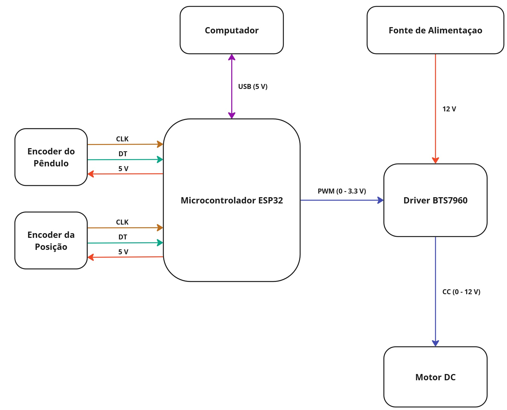
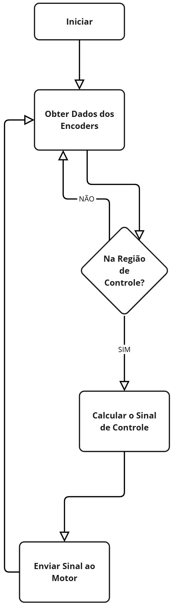

# Pêndulo Invertido com ESP32

## Descrição do Projeto
Este projeto consiste na construção e controle de um pêndulo invertido utilizando um microcontrolador ESP32. O sistema inclui um carrinho motorizado que se desloca sobre um trilho linear, permitindo a estabilização do pêndulo em posição invertida por meio de um algoritmo de controle embarcado.

## Componentes Utilizados
- **Microcontrolador**: ESP32
- **Motor DC**: Modelo 775 (12V, 100W)
- **Driver de Motor**: BTS7960
- **Encoders**:
  - **Pêndulo**: Rotacional incremental (2000 passos/revolução)
  - **Posição**: Rotacional incremental
- **Alimentação**: Fonte de 12V
- **Outros**: Trilho linear, suporte impresso em 3D, polias e correias, jumpers e cabos

## Esquema de Conexões
O sistema é composto por:
- Encoders conectados ao ESP32 para leitura da posição e ângulo do pêndulo
- Driver BTS7960 para controle do motor DC
- Fonte de 12V para alimentação do motor e do driver
- Comunicação via USB com um computador para monitoramento

### Diagrama do Sistema

## Fluxo do Algoritmo
O controle segue a seguinte lógica:
1. **Obter Dados dos Encoders**: O ESP32 lê os valores dos encoders do pêndulo e da posição.
2. **Verificar a Região de Controle**: Se o pêndulo estiver dentro da faixa de atuação, o controle será aplicado.
3. **Calcular o Sinal de Controle**: O algoritmo determina o sinal PWM necessário para o motor.
4. **Enviar o Sinal ao Motor**: O ESP32 envia o comando ao driver BTS7960 para atuar no motor.

### Fluxograma

## Inicialização do Sistema
Antes de iniciar o controle do pêndulo, siga os passos abaixo:
1. **Posicione o carrinho no centro da trilha**.
2. **Coloque o pêndulo para baixo em repouso**.
3. **Conecte o ESP32 ao computador via USB**.
4. **Abra o monitor serial da porta do ESP32** para visualizar os dados.
5. **Pressione o botão "RST" no ESP32** para resetar as variáveis e iniciar a leitura corretamente.

## Monitoramento de Variáveis
O código implementado permite monitorar os valores de posição e ângulo do pêndulo através do terminal serial. Utilize a função `display` para visualizar as variáveis em tempo real.

## Código Implementado
O código embarcado no ESP32 está disponível no final do documento original em PDF. Ele inclui:
- Leitura dos encoders
- Cálculo do sinal de controle
- Envio do sinal PWM ao motor
- Monitoramento das variáveis via serial

## Considerações Finais
Este projeto permite estudar a modelagem, construção e controle de um pêndulo invertido, sendo uma excelente aplicação para controle de sistemas dinâmicos. Qualquer melhoria ou modificação no código deve respeitar a estrutura do algoritmo descrita acima.

# inverted-pendulum-project
